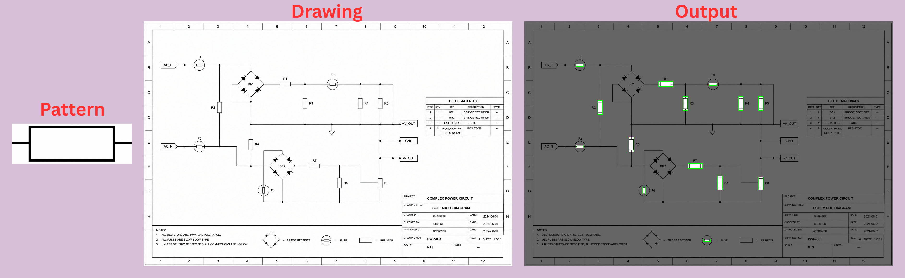

# 🔍 Pattern Detection System

> Rotation-aware, multi-scale template matching for detecting patterns in engineering drawings.


[](https://huggingface.co/spaces/JakeLee111/Pattern-Detection-System)

---

## 📌 Overview

This system detects occurrences of a **pattern image** within a larger **drawing image** using:

- **Multi-scale search** — handles size variation between pattern and target
- **Rotation-aware matching** — tests 0°, 90°, 180°, 270° orientations
- **Non-Maximum Suppression (NMS)** — removes duplicate bounding boxes
- **Confidence scoring** — ranks detections by similarity score



---

## 📁 Repository Structure

```
pattern-detection/
│
├── inference.py          # Standalone inference script (CLI)
├── demo.py               # Gradio web demo
├── requirements.txt      # Python dependencies
│
├── examples/             # Sample images for testing
│   ├── pattern.jpg       # Example pattern image
│   └── drawing.jpg       # Example drawing image
│
└── README.md             # This file
```

---

### Web Demo (demo.py)

[Open your browser at Hugging Face Space](https://huggingface.co/spaces/JakeLee111/Pattern-Detection-System)

Upload:
- A **pattern image** (the symbol/shape you want to find)
- A **drawing image** (the full drawing to search within)

The demo will return:
- Annotated output image with bounding boxes
- JSON list of detections with coordinates and confidence scores

  
---

## ⚙️ Installation

### 1. Clone the repository

```bash
git clone https://github.com/JakeLee111/ZeroShot-BOM-Pattern-Detection
```

```
cd pattern-detection
```

### 2. Create a virtual environment (recommended)

```bash
python -m venv venv
source venv/bin/activate        # Linux/macOS
venv\Scripts\activate           # Windows
```

### 3. Install dependencies

```bash
pip install -r requirements.txt
```


---

## 🚀 Running Inference

### CLI (inference.py)

Place your images in the `examples/` folder, then run:

```bash
python inference.py
```

Expected output:
```
====================================
IMAGE INFORMATION
====================================
Drawing : 1200x900
Pattern : 80x80

Estimated scale: 0.75

====================================
RUNNING MATCHING
====================================
...

====================================
FINAL REPORT
====================================
Final detections: 5

Output saved as output.png
```

The result image `output.png` will be saved in the current directory with **red bounding boxes** and **confidence scores** drawn on each detection.


---

## 🛠️ Configuration

You can adjust the following constants in `inference.py` or `demo.py`:

| Parameter | Default | Description |
|---|---|---|
| `EXPECTED_OBJECT_WIDTH` | `60` | Expected width (px) of pattern in drawing — used to estimate initial scale |
| `THRESHOLD` | `0.8` | Minimum similarity score for a match (0.0–1.0) |
| `SCALES` | linspace ±40% around estimate | Range of scales to search |
| `ROTATIONS` | `[0, 90, 180, 270]` | Rotation angles to test |
| `nms_threshold` | `0.3` | IoU threshold for NMS deduplication |

---

## 📊 Example Output

```json
[
  {
    "x": 145,
    "y": 302,
    "w": 58,
    "h": 58,
    "confidence": 0.9312
  },
  {
    "x": 430,
    "y": 115,
    "w": 58,
    "h": 58,
    "confidence": 0.8874
  }
]
```

---

## 🔧 Pipeline

```
Input Images
     │
     ▼
Grayscale Conversion
     │
     ▼
Scale Estimation (based on EXPECTED_OBJECT_WIDTH)
     │
     ▼
Multi-Rotation Loop (0°, 90°, 180°, 270°)
     │
     ├── Multi-Scale Search (30 scales, ±40% of estimate)
     │       │
     │       └── Template Matching (TM_CCOEFF_NORMED)
     │
     ▼
Raw Detections (all matches above threshold)
     │
     ▼
Non-Maximum Suppression (IoU = 0.3)
     │
     ▼
Annotated Output + JSON Report
```

---

## 📦 Requirements

See `requirements.txt`:

```
opencv-python>=4.5.0
numpy>=1.21.0
gradio>=3.0.0
```

---

## ⚠️ Notes

- This system uses **classical computer vision** (no deep learning model weights)
- No model files need to be downloaded
- Works best with clean, high-contrast patterns on engineering drawings

---

## 📄 License

MIT License — free to use and modify.
